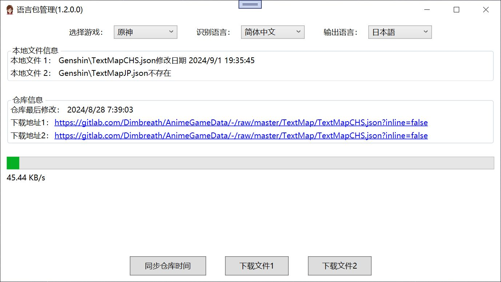

# 原神双语字幕插件

基于[PaddleOCRSharp](https://github.com/raoyutian/PaddleOCRSharp)文本识别和[Genshin_Datasets](https://github.com/AI-Hobbyist/Genshin_Voice_Sorting_Scripts/tree/main/AI%20Hobbyist%20Version/Indexs)原神多语言文本json内容。

## 介绍

期望在展示单一语言剧情文本时，可以同事展示其他语言的对应文本，如中->英， 英->中， 日->中等。

有时候可能喜欢某一语言配音，但对文本理解可能出现偏差。

由于PaddleOCR的限制，本项目只能在64位带avx指令集上的CPU上使用。

## 原理

首先用OCR识别剧情文本，  
然后采用Levenshtein距离匹配现有语言包中文本中对应的名称，  
再根据名称找到其他语言包中的文本展示出来。

## 示例
https://www.bilibili.com/video/BV1qxtjeME7e/

## 更新

**1.2.0**  
1. 启动后不再自动识别，可以通过快捷键`Ctrl+Shift+S`启动和暂停识别
2. 在游戏界面上使用快捷键`Ctrl+Shift+R`可以选择识别区域，通常框出第一行文本的区域
3. 启动和关闭识别有不同的音效，识别运行时，通知栏图标有一个蓝圈
4. 右键菜单中的语言包可以查看和更新，支持原神和星穹铁道
5. 性能大幅提高，延迟显著降低

**1.1.1**  
1. 右键菜单可以选择识别区域

**1.1.0**  
1. 支持星穹铁道
2. 支持调整字体大小
3. 支持13种语言字幕

**1.0.4**  
1. 支持支线剧情
2. 更新4.4部分内容

**1.0.3**  
1. 支持日中字幕
2. 降低短文本匹配错误率

**1.0.2**  
1. 切换语言后重启程序
2. 将名称用旅行者代替
3. 调整菜单顺序

**1.0.1**  
1. 识别区域去除背景，避免同一个字幕解析出不同的结果
2. 增加语言切换功能，测试英中字幕可用

**1.0.0**  
1. 初版实现，中英字幕可用

