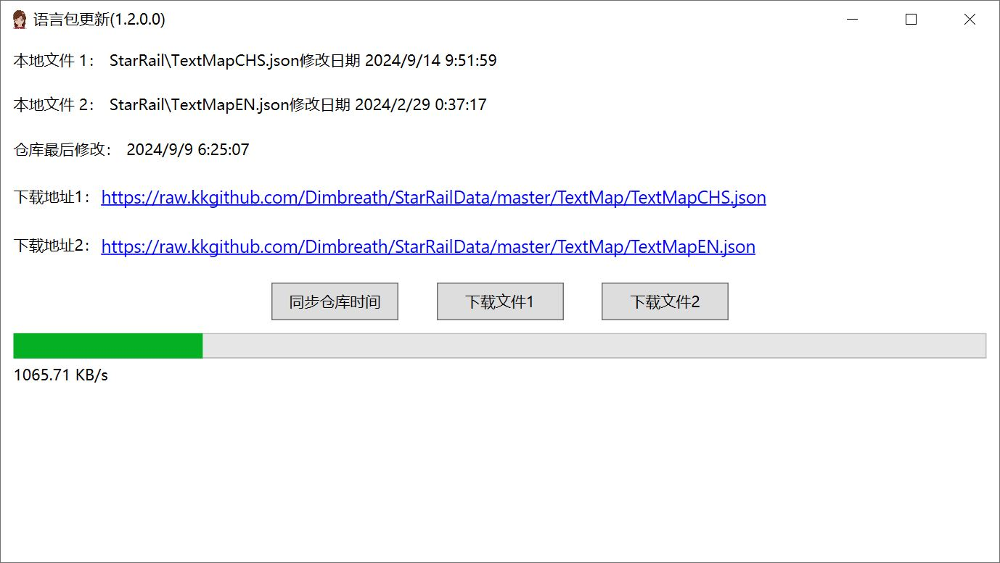

# 原神双语字幕插件

基于 [PaddleOCRSharp](https://github.com/raoyutian/PaddleOCRSharp) 文本识别和 [Genshin_Datasets](https://github.com/AI-Hobbyist/Genshin_Voice_Sorting_Scripts/tree/main/AI%20Hobbyist%20Version/Indexs) 原神多语言文本 json 内容。

## 介绍

期望在展示单一语言剧情文本时，可以同时展示其他语言的对应文本，如中->英，英->中，日->中等。

有时候可能喜欢某一语言配音，但对文本理解可能出现偏差。

由于 PaddleOCR 的限制，本项目只能在 64 位带 AVX 指令集的 CPU 上使用。

## 原理

1. **OCR 识别**: 使用 PaddleOCRSharp 识别游戏画面中的文本
2. **文本匹配**: 采用优化后的 n-gram 索引 + Levenshtein 距离算法匹配现有语言包
3. **翻译展示**: 根据匹配结果找到目标语言文本并展示

## 示例
https://www.bilibili.com/video/BV1qxtjeME7e/



## 核心特性

### 🚀 高性能文本匹配器 (OptimizedMatcher)

- **n-gram 索引**: 中文使用 2-gram，英文使用 4-gram，大幅减少候选集
- **FNV-1a 哈希**: 避免创建大量字符串对象，降低内存占用
- **智能分词**: 自动处理多行文本，识别标题和内容
- **模糊匹配**: 支持 OCR 识别错误的容错匹配

### 📹 视频字幕录入

- 支持从视频文件中自动提取字幕
- 可配置识别区域（通过 `demo_region.json`）
- 批量处理视频内容，生成双语字幕

### 🎯 帧检测优化

- 智能检测画面变化，避免重复 OCR
- 仅在文本变化时触发匹配和更新
- 显著降低 CPU 占用和功耗

### 🔊 AI 配音支持

- 本地 AI 配音文件加载
- 在线配音接口支持
- 空白文本自动跳过配音

## 更新日志

**1.6.3** (当前版本)
1. ✅ 升级 OCR 模型至 PP-OCRv4 mobile 版本（检测 + 识别）
2. ✅ 新增 OptimizedMatcher，性能提升 10 倍以上
3. ✅ 增加视频字幕录入功能（VideoProcessor）
4. ✅ 增加帧检测，优化 OCR 触发时机
5. ✅ 避免空白文本触发配音
6. ✅ 支持崩坏：星穹铁道和崩坏 3
7. ✅ 完整的 CI/CD 测试覆盖（8 个单元测试）

**1.6.0**
- 首次发布 OptimizedMatcher
- 增加视频字幕提取功能
- 帧检测优化

## 快捷键

| 快捷键 | 功能 |
|--------|------|
| `Ctrl+Shift+S` | 启动/暂停 OCR 识别 |
| `Ctrl+Shift+R` | 选择识别区域 |
| `Ctrl+Shift+H` | 隐藏/显示字幕 |

## 技术架构

```
┌─────────────┐    ┌──────────────┐    ┌─────────────┐
│ 游戏画面捕获 │ -> │ OCR 识别     │ -> │ 文本匹配器  │
└─────────────┘    └──────────────┘    └─────────────┘
                                          │
                                          v
┌─────────────┐    ┌──────────────┐    ┌─────────────┐
│ 字幕叠加显示 │ <- │ 翻译文本查找 │ <- │ 语言包数据库 │
└─────────────┘    └──────────────┘    └─────────────┘
```

## 系统要求

- Windows 10/11 64 位
- 支持 AVX 指令集的 CPU
- .NET Framework 4.8
- 内存：至少 2GB 可用内存

## 开发

### 构建

```powershell
# 还原 packages.config、OCR 模型，并用 Visual Studio MSBuild 构建。
# 不要使用 `dotnet build`：本解决方案是 packages.config + .NET Framework。
pwsh -File scripts/Build.ps1 -Configuration Release
```

### 测试

```bash
# 运行单元测试
dotnet vstest GI-Test\bin\Release\GI-Test.dll
```

### CI/CD

本项目使用 GitHub Actions 进行持续集成：

- 每次 Push/PR 自动运行单元测试
- OCR 模型从 Release 下载（不提交到 Git）
- 测试覆盖率：8 个测试用例（7 个通过，1 个条件跳过）

## 许可证

本项目仅供学习和研究使用。

## 致谢

- [PaddleOCRSharp](https://github.com/raoyutian/PaddleOCRSharp) - OCR 引擎
- [Genshin_Datasets](https://github.com/AI-Hobbyist/Genshin_Voice_Sorting_Scripts) - 游戏文本数据
- [Dimbreath/animegamedata2](https://gitlab.com/Dimbreath/animegamedata2) - TextMap 语言包
